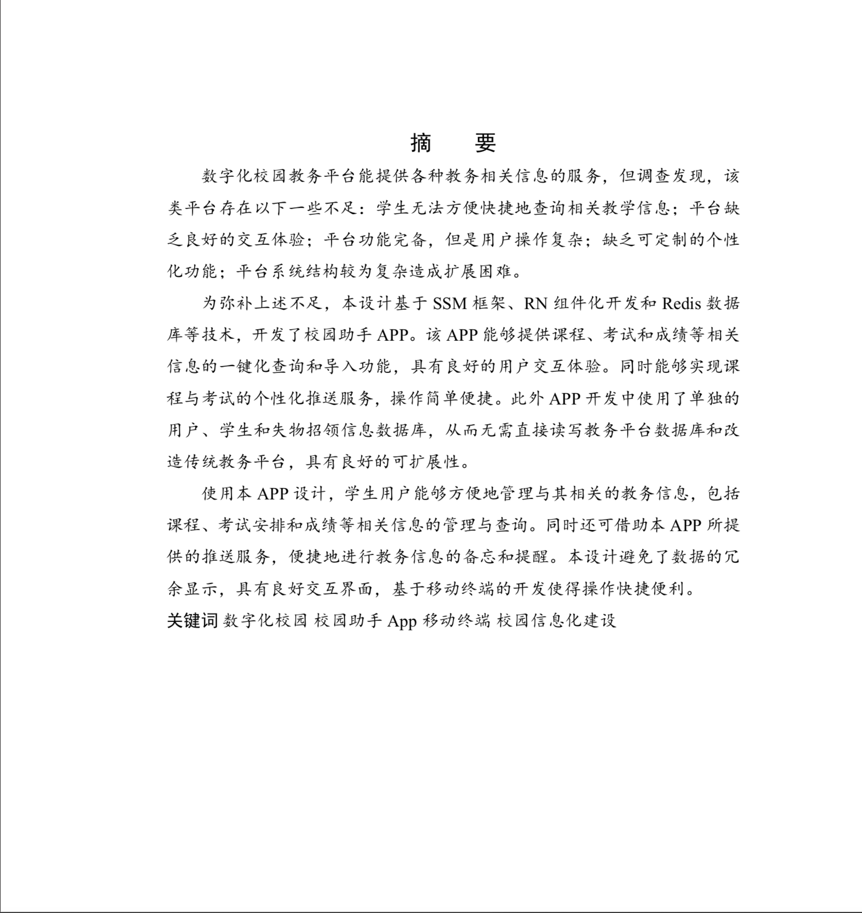
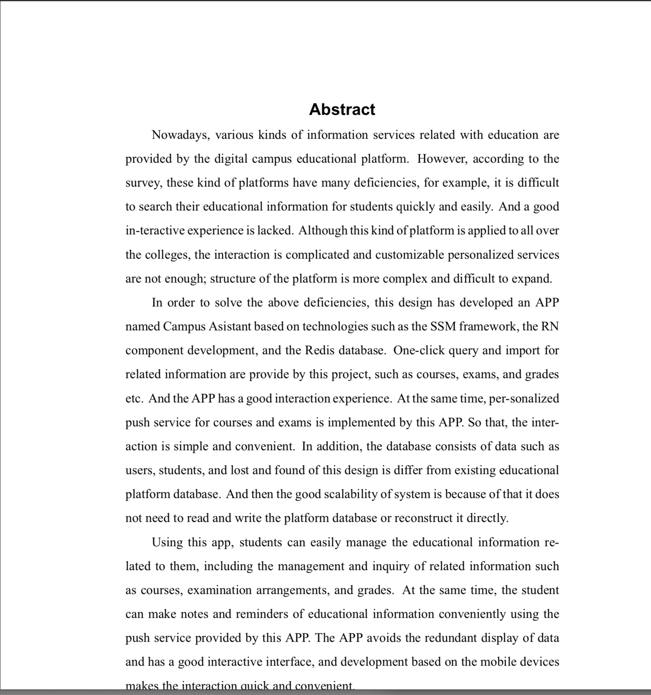
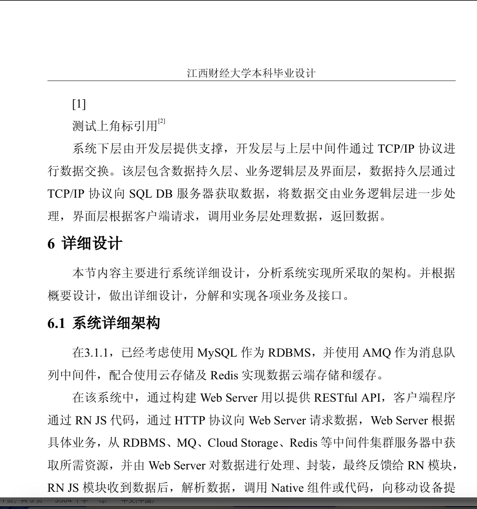
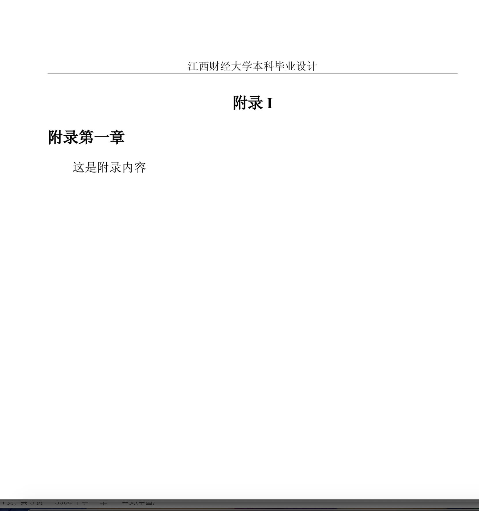
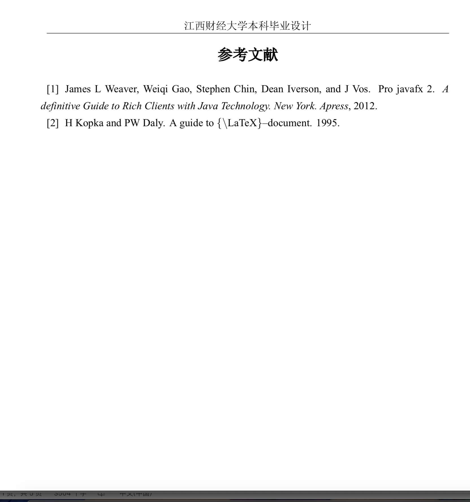

# 江西财经大学本科毕业设计latex模板


## 预览效果

摘要部分，格式遵循以下描述

### 中文摘要

* 中文摘要标题小三号黑体
* 内容小四号楷体
* 中文关键词标题小四号黑体
* 中文关键词小四号楷体



### 英文摘要

* 摘要标题`Arial Black`加粗
* 摘要内容`Times New Roman`，小四号
* 摘要关键词部分，小四号`Arial Black`加粗
* 关键词内容`Times New Roman`



### 正文格式

中文采用了小四号`宋体`，英文采用`Times New Roman`，行距为`22pt`左右，由于`TeX`不支持行距的固定值设置，故根据磅数计算缩放比例，以基准为标准缩放至原有单倍行距`1.528`倍，基本可达到`22pt`效果。

### 正文标题

一级标题，采用**三号宋体加粗**，**居左**，为保证良好的编号样式，我重写了编号间隔，更适合与间隙为空格而非`tab`的样式；

二级标题，采用**小三号宋体加粗居左**；

三级标题，采用**小四号宋体加粗居左**；

四级标题，采用**小四号宋体加粗居左**。

原稿中未对标题行距严格要求，在此根据本人已有word模板近似效果调优，风格较为美观。




### 封面部分

封面部分无严格要求，仅对布局做了调整，并将内容尽量居中显示，保证效果。封面署名信息，设置下划线对齐。

封面标题为**三号宋体加粗居中**。

除了封面外，另加了“诚信承诺书”相关页，相关配置于`jufethesis.cls`文件中`pagecover`相关命令下，可根据需要修改。


### 附录格式

原稿中，对附录未做要求，通常而言学位论文未必包含附录，但是仍然提供基本预设命令。其遵循**小三号宋体加粗居中**格式，并且附录会在前页结尾换页。



### 参考文献

参考文献标题部分，采用**三号宋体加粗居中**格式。参考文献项，采用`BibTex`编译，并使用`gbt7714`样式风格。

其主要样式文件为`gbt-7714-2015-author-year.bst`和`gbt-7714-2015-numerical.bst`，建议拷贝至系统`TEX\bibtex\bst`目录下，样式库具体内容可参考[gbt-7714-2015样式库的相关文档](https://github.com/CTeX-org/gbt7714-bibtex-style)。

若要使用`unsrt`或其他的参考文献样式，请修改`jufethesis.cls`中的对应项即可。

其中参考文献项，采用**五号字体 `18pt`**进行布局，同样地，`18pt`为缩放值。




### 致谢部分

致谢标题采用小三号宋体，正文与论文正文保持一致。


### 目录部分

目录标题，**小3号黑体，居中**；

一级目录，**四号宋体加粗**；

二级目录，**小4号宋体**；

三级目录，**小四号宋体**。

根据要求，暂未将参考文献、致谢、附录等节加入目录，不确定学位论文要求，是否有该要求，有需要可联系添加。


### 页面版式 

左右边距均为`3cm`，由于左侧需要留出装订线，故左边距设为`4m`，其他均与原稿要求保持一致。

页码，封面不编码，摘要、目录采用大些罗马字体，正文采用阿拉伯居中页脚显示。

封面、摘要、目录不预留页眉，正文部分页眉采用`宋体5号`。

对于表格、图片标题，表格标题采用**小四号宋体居中**，图片标题采用**五号宋体居中**。编号格式为，表格采用`X.x`，图片采用`X-x`样式，符合原稿要求。脚注部分采用小五号字体，正文默认上标引用。

表格正文内容格式，可根据`TeX`支持，自行调整，如有需求，可联系新增宏命令，设置内容文本格式字体大小样式。

## 使用教程

请下载或`clone`代码，将`jufethesis.cls`文件与`*.tex`置于同一目录，该模板为支持中文，需要使用`XeLaTeX`编译器进行编译，建议使用`Visual Studio Code + TexLive 2019 + LaTeX Workshop(VSCode扩展插件)`，以下为`VSCode`配置项，配置`XeLaTeX`编译器。

```json
{
    "folders": [
        {
            "path": "."
        }
    ],
    "settings": {
        "files.autoSave": "onFocusChange",
        "editor.tabSize": 2,
        "editor.wordWrap": "on",
        "latex-workshop.latex.tools": [
            {
                "name": "xelatex",
                "command": "xelatex",
                "args": [
                    "-synctex=1",
                    "-interaction=nonstopmode",
                    "-file-line-error",
                    "%DOCFILE%"
                ]
            },
            {
                "name": "latexmk",
                "command": "latexmk",
                "args": [
                    "-synctex=1",
                    "-interaction=nonstopmode",
                    "-file-line-error",
                    "-pdf",
                    "%DOCFILE%"
                ]
            },
            {
                "name": "pdflatex",
                "command": "pdflatex",
                "args": [
                    "-synctex=1",
                    "-interaction=nonstopmode",
                    "-file-line-error",
                    "%DOCFILE%"
                ]
            },
            {
                "name": "bibtex",
                "command": "bibtex",
                "args": [
                    "%DOCFILE%"
                ]
            }
        ],
        "latex-workshop.latex.recipes": [
            {
                "name": "xelatex -> bibtex -> xelatex * 2",
                "tools": [
                    "xelatex",
                    "bibtex",
                    "xelatex",
                    "xelatex"
                ]
            },
            {
                "name": "pdflatex -> bibtex -> pdflatex*2",
                "tools": [
                    "pdflatex",
                    "bibtex",
                    "pdflatex",
                    "pdflatex"
                ]
            }
        ],
        "editor.largeFileOptimizations": false,
        "latex-workshop.view.pdf.viewer": "tab",
        "latex-workshop.latex.magic.args": [
            "-shell-escape",
            "-synctex=1",
            "-interaction=nonstopmode",
            "-file-line-error",
            "%DOCFILE%"
        ],
        "editor.suggestSelection": "first",
    }
}
```

为生成目录及引用，需要使用二次编译。

配置文件的使用，需要在`TeX`目录下，新建`.vscode`目录，并新建`settings.json`，将上述内容拷贝粘贴即可。具体配置，可参阅相关资源。
亦或是在本项目的目录下新建`根文件夹名称.code-workspace`文件，并拷贝上述内容。
